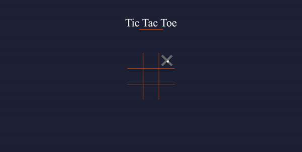

# TicTacToe Game

This is a simple Tic Tac Toe game that uses vanilla HTML, CSS, and JavaScript. This project shows my core understanding of DOM manipulation, scopes, hoisting and closures in JavaScript

## Demo

The game starts off with X's turn and whoevers turn it is, the hover state will show

If there is a winner, a pop up screen will show either X's wins, or O's wins

If there is a draw, the pop up will show a draw

## Features

- Hover state to show turns
- TicTacToe game logic
- Responsive on all devices
- SVG icon depending on win or draw
